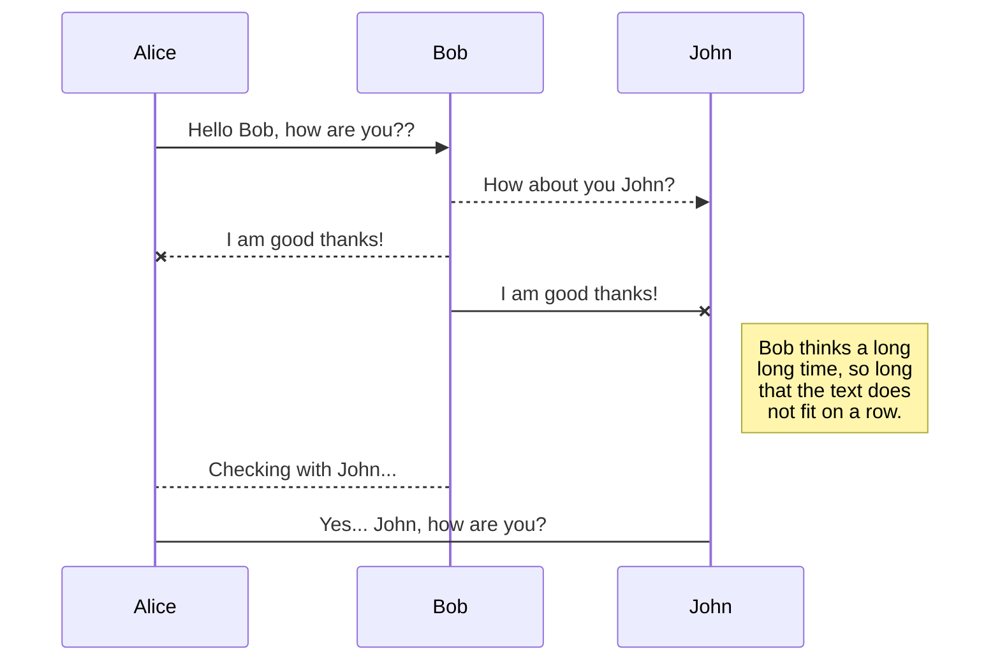

本节将介绍 Markdown 高级的语法，这些语法可能不兼容其他 Markdown 平台。

---

## 语法高亮

### 基础使用

````markdown
```javascript
function fancyAlert(arg) {
  if (arg) {
    $.facebox({ div: "#foo" });
  }
}
```
````

<details open>
  <summary>效果预览</summary>

<Example>

```javascript
function fancyAlert(arg) {
  if (arg) {
    $.facebox({ div: "#foo" });
  }
}
```

</Example>
</details>

### 代码高亮

````markdown
```javascript{1,3-4}
function fancyAlert(arg) {
  if (arg) {
    $.facebox({ div: "#foo" });
  }
}
```
````

<details open>
  <summary>效果预览</summary>

<Example>

```javascript{1,3-4}
function fancyAlert(arg) {
  if (arg) {
    $.facebox({ div: "#foo" });
  }
}
```

</Example>

</details>

### 显示行号

````markdown
```javascript{numberLines: true}
function fancyAlert(arg) {
  if (arg) {
    $.facebox({ div: "#foo" });
  }
}
```
````

<details open>
  <summary>效果预览</summary>

<Example>

```javascript{numberLines: true}
function fancyAlert(arg) {
  if (arg) {
    $.facebox({ div: "#foo" });
  }
}
```

</Example>

</details>

### Diff 样式

````markdown
```diff-javascript
function fancyAlert(arg) {
  if (arg) {
-    jQuery.facebox({ div: "#foo" });
+    $.facebox({ div: "#foo" });
  }
}
```
````

<details open>
  <summary>效果预览</summary>

<Example>

```diff-javascript
function fancyAlert(arg) {
  if (arg) {
-    jQuery.facebox({ div: "#foo" });
+    $.facebox({ div: "#foo" });
  }
}
```

</Example>

</details>

### 命令行优化

````markdown
```shell{outputLines:2-4}
npm install -g CAZ
node_modules/caz/bin/caz.js
+ caz@0.6.0
added 63 packages from 64 contributors in 3.006s
```
````

<details open>
  <summary>效果预览</summary>

<Example>

```shell{outputLines:2-4}
npm install -g CAZ
node_modules/caz/bin/caz.js
+ caz@0.6.0
added 63 packages from 64 contributors in 3.006s
```

</Example>

</details>

### 文件头

````markdown
```shell{header: Install CAZ}{outputLines:2-4}
npm install -g CAZ
node_modules/caz/bin/caz.js
+ caz@0.6.0
added 63 packages from 64 contributors in 3.006s
```
````

<details open>
  <summary>效果预览</summary>

<Example>

```shell{header: Install CAZ}{outputLines:2-4}
npm install -g CAZ
node_modules/caz/bin/caz.js
+ caz@0.6.0
added 63 packages from 64 contributors in 3.006s
```

</Example>

</details>

## 任务列表

```markdown
- [x] @mentions, #refs, [links](), **formatting**, and <del>tags</del> supported
- [x] list syntax required (any unordered or ordered list supported)
- [x] this is a complete item
- [ ] this is an incomplete item
```

<details open>
  <summary>效果预览</summary>

<Example>

- [x] @mentions, #refs, [links](), **formatting**, and <del>tags</del> supported
- [x] list syntax required (any unordered or ordered list supported)
- [x] this is a complete item
- [ ] this is an incomplete item

</Example>

</details>

## 表格

```markdown
| Tables   |      Are      |  Cool |
| -------- | :-----------: | ----: |
| col 1 is | left-aligned  | $1600 |
| col 2 is |   centered    |   $12 |
| col 3 is | right-aligned |    $1 |
```

<details open>
  <summary>效果预览</summary>

<Example>

| Tables   |      Are      |  Cool |
| -------- | :-----------: | ----: |
| col 1 is | left-aligned  | $1600 |
| col 2 is |   centered    |   $12 |
| col 3 is | right-aligned |    $1 |

</Example>

</details>

## 数学公式

支持行内和块级两种样式进行数学公式展示。

<Aside header="提示" color="yellow">

如果你对 LaTeX 语法不是很熟悉，请阅读 <Link showIcon href="https://www.yuque.com/yuque/help/math">《如何插入数学公式》</Link>。

</Aside>

```markdown
行内数学公式： $$\sum_{i=0}^n i^2 = \frac{(n^2+n)(2n+1)}{6}$$

下面是块级数学公式：

$$
\sum_{i=0}^n i^2 = \frac{(n^2+n)(2n+1)}{6}
$$
```

<details open>
  <summary>效果预览</summary>

<Example>

行内数学公式： $$\sum_{i=0}^n i^2 = \frac{(n^2+n)(2n+1)}{6}$$

下面是块级数学公式：

$$
\sum_{i=0}^n i^2 = \frac{(n^2+n)(2n+1)}{6}
$$

</Example>

</details>

## Mermaid 支持

[Mermaid](https://mermaid-js.github.io/mermaid/#/) 是一款非常酷的图形库，你可以使用该库的[语法规则](https://mermaid-js.github.io/mermaid/#/n00b-syntaxReference)，实现各种常见的图形。

````markdown

````

<details open>
  <summary>效果预览</summary>


</details>

## `<details>` 和 `<summary>`

`<details>` 和 `<summary>` 是原生 HTML5 支持的标签，可以有折叠展开的效果。

```markdown
<details>
  <summary>全球最大的同性交友网站是？</summary>

Github

</details>

<details open>
  <summary>全球最大的二刺猿网站是？</summary>

Bilibili

</details>
```

<details open>
  <summary>效果预览</summary>

<Example>

<details>
  <summary>全球最大的同性交友网站是？</summary>

Github

</details>

<details open>
  <summary>全球最大的二刺猿网站是？</summary>

Bilibili

</details>

</Example>

</details>

<Aside header="注意" color="yellow">

MDX 对嵌套 Markdown 与 JSX 语法识别有一些[问题](https://github.com/mdx-js/mdx/issues/628)。如果你在组件内使用 Markdown 语法，请格外注意缩进：

```diff-markdown
<details>
  <summary>效果预览</summary>

-  <Example>
-    - item1
-    - item2
-  </Example>
+<Example>
+
+- item1
+- item2
+
+</Example>

</details>
```

</Aside>

## iframe 支持

### B 站

```markdown
<div class="aspect-w-16 aspect-w-9">
  <iframe width="100%" height="100%" src="//player.bilibili.com/player.html?aid=840488687&bvid=BV1m54y1Q7eQ&cid=182078162&page=1" scrolling="no" border="0" frameborder="no" framespacing="0" allowfullscreen="true"> </iframe>
</div>
```

<details open>
  <summary>效果预览</summary>

<Example>

<div class="aspect-w-16 aspect-h-9">
  <iframe
    width="100%"
    height="100%"
    src="//player.bilibili.com/player.html?aid=840488687&bvid=BV1m54y1Q7eQ&cid=182078162&page=1"
    scrolling="no"
    border="0"
    frameborder="no"
    framespacing="0"
    allowfullscreen="true"
  >
    {" "}
  </iframe>
</div>

</Example>

</details>
